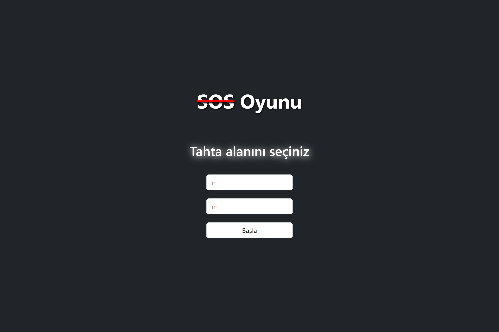
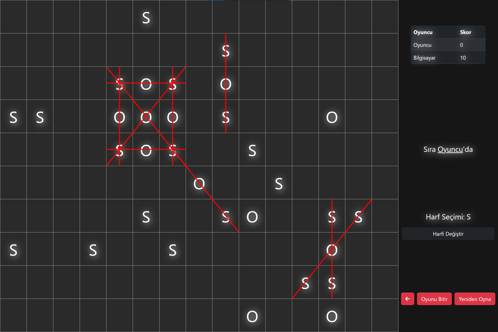

## Projeyi local ortamda çalıştırmak için:

`XAMPP` veya PHP kodlarını sunabilecek `Apache` gibi herhangi bir web sunucusu kullanılması gerekiyor.

- Kullanılan XAMPP sürümü: 7.4.29
- Kullanılan PHP sürümü: 7.4.29

Web Sunucusu kurulumundan sonra index.php dosyasına localhost adresinden ulaşarak uygulamaya erişebilirsiniz:

> örneğin: http://localhost/sos/ veya http://localhost/sos/index.php

 

 

## Örnek Ekran Görünüleri:

